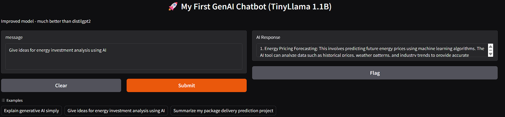

# Project 1: My First GenAI Chatbot

**Built as part of my GenAI from Scratch Journey**

## Overview
I built an interactive web-based chatbot using **Hugging Face Transformers** and **Gradio** in Google Colab. This was my first hands-on project with Generative AI.

## Tech Stack
- Python
- Hugging Face `transformers` library
- TinyLlama-1.1B-Chat-v1.0 (small open-source model)
- Gradio (for web interface)
- Google Colab (T4 GPU - free)

## What I Built
- A functional chatbot with a clean web UI
- Proper prompt formatting for the model
- Error handling and response cleaning
- Example prompts related to my previous ML projects (energy investment analysis & package delivery prediction)

## Key Learnings
- How to load and run pre-trained language models using `pipeline()`
- Understanding model limitations (small models vs large models)
- Building interactive UIs with Gradio
- Prompt engineering basics
- Working with Google Colab environment and GPU runtime
- Saving and sharing GenAI projects on GitHub

## Limitations (Honest)
- Since we're using a small 1.1B parameter model on free Colab resources, responses are sometimes short or not very creative.
- This project helped me understand why real-world applications use larger models (Llama 3, Mistral, etc.) or fine-tuning.

## How to Run
1. Open the notebook in Google Colab
2. Change runtime to T4 GPU
3. Run all cells
4. Click the public URL to open the chatbot

