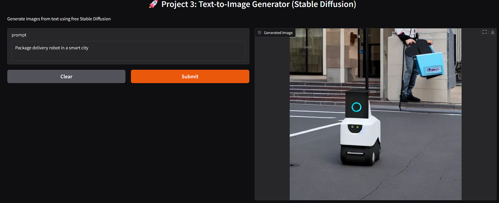

# Project 3: Text-to-Image Generator (Stable Diffusion)

**Built as part of my GenAI from Scratch Journey**

## Overview
Built a web application that generates images from text prompts using **Stable Diffusion** — one of the most popular open-source generative AI models.

## Tech Stack
- Hugging Face `diffusers`
- Stable Diffusion v1-4 model
- Gradio (web interface)
- Google Colab (T4 GPU)

## Key Features
- Text-to-Image generation
- Multiple creative examples related to my domain (energy, delivery)
- Clean interactive UI

## Key Learnings
- Working with diffusion models
- GPU memory management in Colab
- Building creative GenAI applications
- Understanding different types of generative models (text vs image)

## How to Run
1. Open notebook in Colab
2. Runtime → T4 GPU
3. Run all cells
4. Use the public URL
